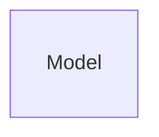

# ER Modeling

## Basic ER Modeling Concepts

**Entity**: Real-world object distinguishable from other objects. An entity is described (in DB) using a set of _attributes_.

- represented by a Rectangle and connected with Attributes represented by circles

**Entity Set**: A collection of entities of the same type (e.g. all employees)

- All entities in an entity set have the same set of attributes
- Each entity has a key (underlined)

**Relationship**: Association among two or more entities. Relationships can have their own attributes. (e.g. Fred works in the Pharmacy department)

**Relationship Set**: Collection of relationships of the same type. (e.g. Employees work in departments)

## Constraints

### Key Constraints

Key constraints determine the number of objects taking part in the relationship set (how many from each side)

Types of key constraints:

- One-to-One
- One-to-Many (Many-to-One)
- Many-to-Many

### Participation Constraints

Participation constraint explores whether all entities of one entity set take part in a relationship. If yes this is a **total** participation, otherwise it is **partial**. Total participation says that each entity takes part in “**at least one**” relationship, and is represented by a bold line.

## Weak Entities

A weak entity can be identified uniquely only by considering (the primary key of) another (owner) entity. They are represented as a “bold” rectangle.

## Special Attribute Type

### Multi-Valued Attributes

Multi-valued attributes can have multiple (finite set of) values of the same type.

- represented by a double circle

### Composite Attributes

Composite attributes have a structure hidden inside (each element can be of different type).

- represented by attributes connected to a attribute
