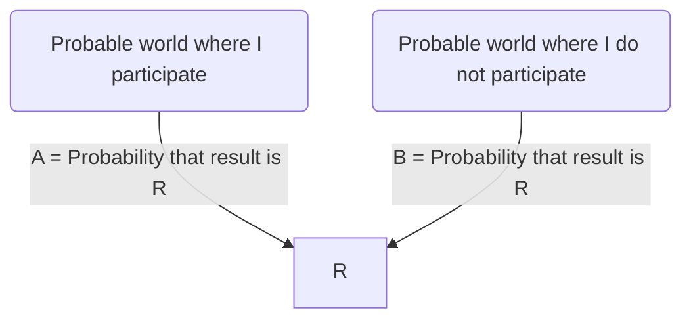

# Week 11

## Privacy

### Measures of Anonymity for Individuals

- K-anonymity
- L-diversity

> Terminology:
> - explicit identifier: unique for individuals
> - quasi-identifier: combination of non-sensitive attributes that can be linked with external data to identify individuals
> - sensitive attributes: information that people don't want to reveal

### K-anonymity

- A table satisfies k-anonymity if any record in the table is indistinguishable from at least k-1 other records.
- For any combination of quasi-identifier, there are at least k records that share those values

How to achieve:

- generalization
- suppression

Attacks:

- Homogeneity attack
- Background attack

### L-diversity

- For each k anonymous group, there are at least l different sensitive attribute values.

> Limitations:
> - Imbalanced number of occurrences of a sensitive attribute within a group may limit usefulness
> - Can be unnecessary and difficult to achieve
> - Similarity attacks

## Differential Privacy

- Local:
    - Each person is responsible for adding noise
- Global:
    - We have a sensitive dataset and a trusted data owner A and researcher B. A does analysis on data and add noise to answer, then reports the answer with noise to B.
    - More accurate, less noise needed.

### Privacy Loss Budget = K

Choose k to guarantee that $A \le 2^k \times B$

1. k = 0, no privacy loss, low utility
2. k = high, high privacy loss, high utility
3. k = low, low privacy loss, low utility

### Global Sensitivity = G

How different the result will be if one record is added or removed.

### Strategy

- sample the noise from a distribution with
    - mean = 0
    - standard deviation = G/k
- Details about the distribution (the Laplace distribution)
