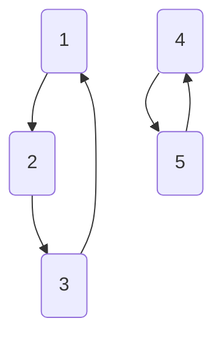

# Week 5

## Group

A **group** $(G, *)$ is a set $G$ with an operation $*: G \times G \to G$, such that

1. $g * (h * k) = (g * h) * k$ for all $g, h, k \in G$
2. There exists $e \in G$ such that $g * e = e * g = g$ for all $g \in G$
3. For every $g \in G$ there exists $g^{-1} \in G$ such that $g * g^{-1} = e$ ($g^{-1}$ is called an inverse of $g$)

An *abelian* group is a group $G$ such that $gh = hg$ for all $g, h \in G$.

> [!NOTE]
> - $k^\times = K \setminus \{0\}$, $(K^\times, \times)$ is a group 
> - $GL_n(K) = \{M \in M_n(K) \mid M is invertible\}$
> - $SL_n = \{M \in M_n(K) \mid \det(M) = 1\}$

---

Let $G$ be a group and $H$ a subset of $G$. Then $H$ is a *subgroup* of $G$ if and only if

1. $e \in H$
2. if $h_1, h_2 \in H$, then $h_1h_2 \in H$
3. if $h \in H$, then $h^{-1} \in H$

---

Let G be a group. Then

1. $G$ has a unique identity element
2. each $g \in G$ has unique inverse
3. the inverse of $gh$ is $h^{-1}g^{-1}$

---

Let G be a group.

1. (cancellation law):
    1. if $gx = gy$, then $x = y$;
    2. if $xh = yh$, then $x = y$
2. (solving equations): given $g, h \in G$,
    1. there exists unique $x \in G$ such that $gx = h$
    2. there exists unique $y \in G$ such that $gy = h$

---

The *order* of a group G is the number of elements of G.

## Symmetric Groups

We represent this in cycle notation as $f = (1 \ 3 \ 5)(2 \ 4)$

> [!NOTE]
> The cycle notation is not unique. i.e. $(1 \ 3 \ 5)(2 \ 4) = (3 \ 5 \ 1)(4 \ 2) = \dotsb$
