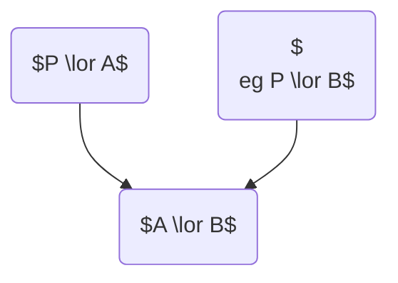

# Week 3

## Normal Forms for Propositional Logic

A **literal** is P or ¬P where P is a propositional letter.

A **formula** is in **conjunctive normal form** (CNF) if it is a conjunction of disjunctions of literals (a conjunction of *clauses*).

It is in **disjunctive normal form** (DNF) if it is a disjunction of conjunctions of literals.

Theorem: Every propositional formula can be expressed in CNF, as well as in DNF.

### Converting a Formula to CNF or to DNF

- Eliminate all occurrences of $\oplus$, using $A \oplus B \equiv (A \lor B) \land (\neg A \lor \neg B)$
- Eliminate all occurrences of $\iff$, using $A \iff B \equiv (A \implies B) \land (B \implies A)$
- Eliminate all occurrences of $\implies$, using $A \implies B \equiv \neg A \lor B$
- Use De Morgan’s Laws to push $\neg$ inward over $\land$ and $\lor$
- Eliminate double negations using $\neg \neg A \equiv A$
- Use the distributive laws to get the required form.

### Reduced CNF

A CNF formula is in *reduced CNF* (RCNF) if, for each of its clauses, no propositional letter occurs twice.

### Empty CNF Clauses

We agree that the empty clause $\emptyset$ represents $\bot$ (false).

### Empty CNF Formulas

We agree that the empty formula $\emptyset$ represents $\top$ (true).

## Resolution-Based Inference

Consider the two clauses $P \lor A$ and $\neg P \lor B$

If $(\neg P \lor A)$ and $(P \lor B)$ are both true, then either $A$ is true or $B$ is true (or both).

The clause $A \lor B$ is a *logical consequence* of the two original clauses.

We call $A \lor B$ their **resolvent**.

Let $C_1$ and $C_2$ be clauses such that $P \in C_1$ and $\neg P \in C_2$.

$(C_1 \setminus \{P\}) \cup (C_2 \setminus \{\neg P\})$ is a resolvent of $C_1$ and $C_2$

Theorem: If $R$ is a resolvent of $C_1$ and $C_2$ then $C_1 \land C_2 \models R$.

## Predicate Logic

- Existential quantification, $\exists$, is generalised $\lor$.
- Universal quantification, $\forall$, is generalised $\land$.

## Terminology

A **term** is a variable or a constant or a construction, $f(t_1, \dots, t_n)$,where $n > 0$, $f$ is a function symbol of arity $n$, and each $t_i$ is a term.

An **atomic formula** (or atom) is a construction $P(t_1, \dots, t_n)$ where $n \ge 0$ and $P$ is a predicate symbol of arity $n$, and each $t_i$ is a term.

A **literal** is an atomic formula or its negation.

> [!NOTE]
> The convention we adopt: A predicate starts with an upper case letter; nothing else does.

> [!EXAMPLE]
> $parent(ronda)$ is a term; it denotes some object.
>
> (Most likely we intend this to mean: “the parent of Ronda”)
>
> $Parent(ronda)$ is a formula; it denotes a truth value.
>
> (Most likely we intend this to mean: “Ronda is a parent”)

## Bound and Free Variables

A variable which is in the scope of a quantifier (binding that variable) is *bound*. If it is not bound then it is *free*.

A formula with no free variable occurrences is *closed*.
