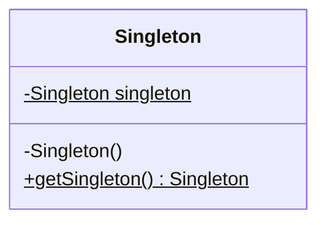
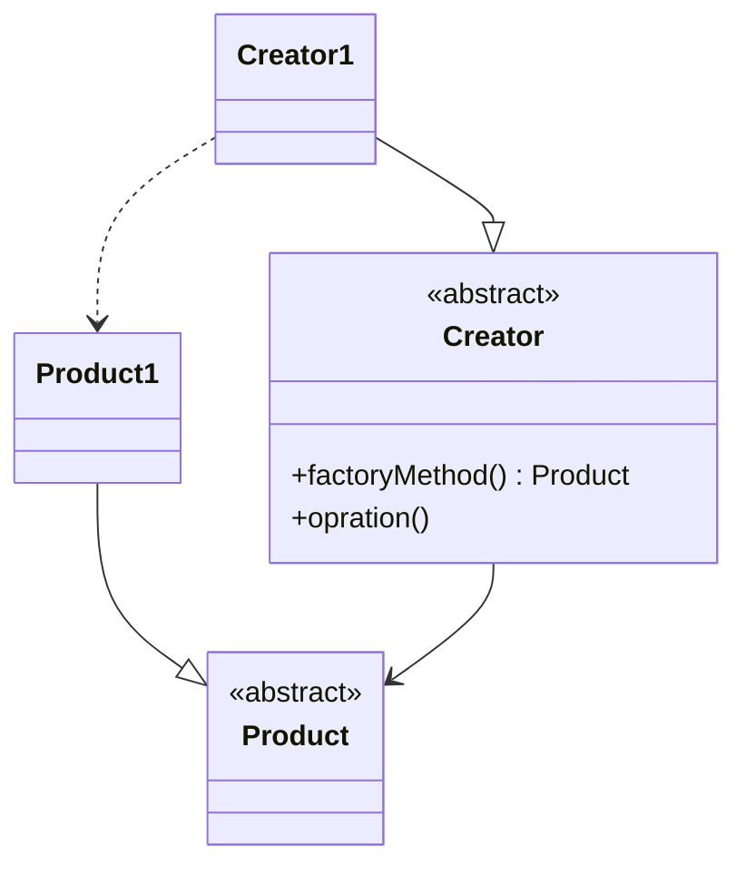
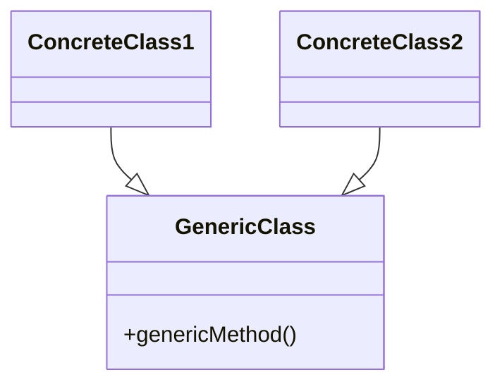
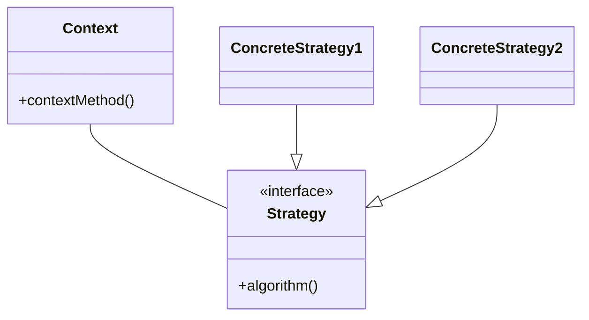
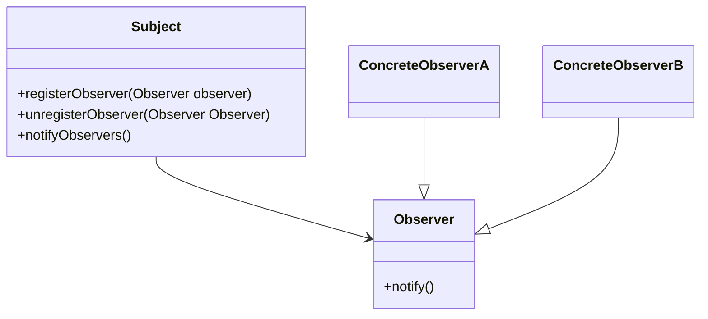

# Design Patterns

## Singleton

```mermaid
classDiagram
class Singleton {
  -Singleton singleton$
  -Singleton()
  +getSingleton()$ Singleton
}
```

## Factory Method

```mermaid
classDiagram
class Creator {
 <<abstract>>
 +factoryMethod() Product
 +opration()
}
class Product {
  <<abstract>>
}
Creator1 --|> Creator
Product1 --|> Product
Creator --> Product
Creator1 ..> Product1
```

## Template Method and Strategy

Template Method uses **Inheritance**

```mermaid
classDiagram
class GenericClass {
  +genericMethod()
}

ConcreteClass1 --|> GenericClass
ConcreteClass2 --|> GenericClass
```

Strategy uses **Delegation**

```mermaid
classDiagram
class Context {
  +contextMethod()
}
class Strategy {
  <<interface>>
  +algorithm()
}
Context -- Strategy
ConcreteStrategy1 --|> Strategy
ConcreteStrategy2 --|> Strategy
```

## Observer

```mermaid
classDiagram
class Subject {
  +registerObserver(Observer observer)
  +unregisterObserver(Observer Observer)
  +notifyObservers()
}
class Observer {
 +notify()
}
Subject --> Observer
ConcreteObserverA --|> Observer
ConcreteObserverB --|> Observer
```

